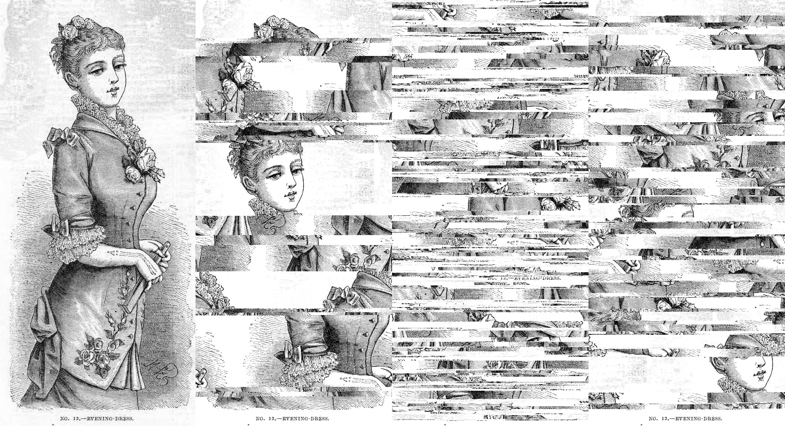

# Glitch
###### a glitchart toolbox

So far this toolbox consists of a single tool called `glitch`

It applies a bijective version of [Burrows-Wheeler transform](https://en.wikipedia.org/wiki/Burrows%E2%80%93Wheeler_transform) (implementation by Yuta Mori, original code [here](https://encode.su/threads/104-libBWT?p=22938&viewfull=1#post22938)) to the provided data, introduces a desired number of errors, and performs an inverse transform.

This procedure tends to mix around chunks of data in an interesting way. To achieve best results use uncompressed data with lots of redundancy.

For audio data, I suggest converting it to wav format with unsigned 8-bit PCM encoding. If results are too distorted, you might want to try increasing redundancy by appending multiple copies of the same audio. For images, raw (e.g. not ASCII) PGM works best.

Overall, results are extremely unpredictable so don't expect to always get interesting results.

```
Usage: ./glitch [options]
Options:
 -i <in file>
 -o <out file>
 -s <seed>
 -f <number of bytes to swap>
 -k <number of bytes to skip>
```

By default it takes input from stdin, outputs to stdout. Time is used for seeding, one byte is changed and nothing is skipped.

Use `-k` option to avoid corrupting headers of wav or ppm files.

## Examples

```
>>> cat > ./sample.txt
```
> I leave Sisyphus at the foot of the mountain! One always finds one’s burden again. But Sisyphus teaches the higher fidelity that negates the gods and raises rocks. He too concludes that all is well. This universe henceforth without a master seems to him neither sterile nor futile. Each atom of that stone, each mineral flake of that night filled mountain, in itself forms a world. The struggle itself toward the heights is enough to fill a man’s heart. One must imagine Sisyphus happy.

```
>>> ./glitch -i ./sample.txt
```
> I leave a master seems to him neithout This well. One always finds one’s burden again. He too concludes that all ises rocks. But Sither sterile nor futile. Each atom of that stone, each mineral flake of that night filled mountain, in itself toward the heights is unjs enough to fill a man’s heart. One must imagine Sisyphus teaches the higher fideliverse henceforth witself forms a world. The struggle ity that negates the gods and raisyphus at the foot of the mountain! Sisyphus happy.

```
>>> ./glitch -f10 -i ~/sample.txt
```
> I mwelled foot syphus heastoneggle leays fill itses that nougher entain, is agatomao a ml One, each moun’s ise hight in!hencm niwart. Each ave mine’s burden itst neral forms without flake of to filudes the ms a! Sisyphus the heigine Sit Sit a mountain. One neither syphus ates too cond rockseemusterile of the forth world. The teaches werself futile. But all. This. He towbrd the himagine am of unor gainceg that the gods ands selfidelity that that onights raister strugh to imat happy.


````
>>> ./glitch -k 100  -i ~/sample.pgm
````

[Original](http://www.reusableart.com/evening-dress-1881.html) and a few variations of the output:



```
>>> ./glitch -k 100  -i ~/sample.wav
```

[Result](./example.ogg) and the [original](https://www.youtube.com/watch?v=9Px-XT-Pg8o), also available as `example.orig.ogg` in this repo.

## Limitations

This algorithm works on bytes of data, so it's unlikely to produce interesting results when the input consits of multi-byte data (e.g. a stream of 32-bit int values).

It's also mainly suited for one-dimensional data like audio or text. Using it on pictures or videos will likely produce mediocre results.
